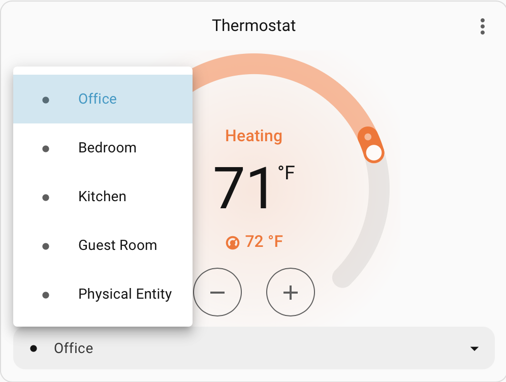

# Thermostat Proxy (Home Assistant)


A Home Assistant custom integration that lets you expose a virtual `climate` entity which mirrors a real thermostat but lets you pick any temperature sensor to act as the “current temperature”. When you change the virtual target temperature, the integration calculates the difference between the selected sensor and the requested set point, then offsets the real thermostat so it behaves as if it were reading the chosen sensor.

## Installation via HACS

[](https://my.home-assistant.io/redirect/hacs_repository/?repository=thermostat-proxy&category=integration&owner=jianyu-li)




## Features

- Wraps an existing `climate` entity; copies all of its attributes for dashboards/automations.
- Supports any number of temperature sensors. Each named sensor becomes a `preset_mode`, so changing the preset swaps the active sensor.
- Falls back to the real thermostat’s `current_temperature` whenever the selected sensor is unknown or unavailable.
- `climate.set_temperature` service adjusts the linked thermostat by the delta between the selected sensor reading and your requested temperature.
- Exposes helper attributes: active sensor, sensor entity id, real current temperature, and the last real target temperature.
- Remembers the previously selected sensor/target temperature across restarts and surfaces an `unavailable_entities` attribute so you can monitor unhealthy dependencies.
- Always adds a built-in preset for the wrapped thermostat’s own temperature reading (named `Physical Entity` by default, but you can rename it during setup) so you can revert or set it as the default sensor.
- If someone changes the physical thermostat directly, the proxy automatically switches to the physical preset and logs the change in Home Assistant's logbook.
- **Overdrive** logic: If the remote sensor hasn't reached the target but the physical thermostat thinks it's done (e.g. goes "Idle"), the proxy will temporarily offset the real target by an additional degree to force the HVAC to keep running until the remote sensor is satisfied.
- **Auto & Heat-Cool Mode Support**: Fully supports dual-setpoint modes (`HEAT_COOL` and `AUTO`) with remote sensors. The proxy automatically calculates independent high and low setpoint offsets to regulate both heating and cooling at the remote sensor's location.
- **Fan & Swing Mode Support**: Fully proxies the real thermostat's fan and swing modes. You can control the fan (Auto/On/Low/etc.) and swing directions seamlessly through the proxy entity.
- **User Log Attribution**: Logbook entries for target temperature or preset changes will show which user performed the action.
- **Safety Limits**: Configure custom `min_temp` and `max_temp` bounds. Calculated targets are clamped to these limits to prevent extreme requests due to sensor anomalies or to respect operational restrictions enforced by certain thermostats that aren't exposed through their Home Assistant attributes.
- **Hardware-Accurate Control Resolution**: Automatically detects the exact precision of your physical thermostat (e.g., 0.5°) and preserves it when setting target temperatures, regardless of whether your selected remote sensor reports coarse, whole-degree values.
- **Sensor Change Threshold**: Configurable `sensor_change_threshold` (e.g. 0.5°) to prevent equipment short-cycling by filtering minor sensor fluctuations, while always overriding the threshold when the remote sensor reaches or crosses the target temperature.
- Default sensor selector includes a "Last active sensor" option (during setup or in options) so the proxy resumes with the most recently selected sensor instead of the configured default.
- **Humidity Sensor Pairing**: Optionally bind a humidity sensor to any preset. When that preset is active, `current_humidity` reads from the paired humidity sensor. If a paired humidity sensor is unavailable/offline or if a preset has no paired humidity sensor, `current_humidity` seamlessly falls back to the physical thermostat's built-in humidity reading.
- **Humidity Overdrive**: When the active preset has a paired humidity sensor and the current humidity exceeds the target, the proxy can overcool (lower the cooling setpoint) to run the compressor for dehumidification, even when the temperature target is already met. A configurable `max_humidity_overcool` limit prevents excessive cooling.

## Configuration

| Option | Required | Default | Description |
|---|---|---|---|
| `name` | Yes | `Thermostat Proxy` | The name of the virtual climate entity. |
| `thermostat` | Yes | | The entity ID of the physical thermostat to wrap. |
| `target_sensor` | No | | The entity ID of the default temperature sensor to use. If not specified, the proxy will default to the `Physical Entity` preset. |
| `physical_sensor_name` | No | `Physical Entity` | The name of the preset representing the physical thermostat itself. |
| `cooldown_period` | No | `0` (Disabled) | **Minimum Adjustment Interval**: Minimum time (in seconds) between automatic updates to the physical thermostat. Useful for preventing rapid cycling with noisy sensors. Retries automatically when cooldown expires. |
| `min_temp` | No | `0` (Disabled) | **Minimum Safe Temperature Limit**: Calculated targets sent to the physical thermostat will not go below this value. Set to 0 to disable. |
| `max_temp` | No | `0` (Disabled) | **Maximum Safe Temperature Limit**: Calculated targets sent to the physical thermostat will not exceed this value. Set to 0 to disable. |
| `max_sync_offset` | No | `10.0` (Disabled via 0) | **Maximum Sync Offset**: Circuit breaker to prevent wild sensor readings. Limits how far the physical thermostat target can drift from the virtual target. |
| `disable_auto_switch` | No | `False` | **Disable Auto-Switch**: When turned on, the proxy will maintain the active remote sensor and its offset when a manual change is made directly on the physical thermostat, instead of automatically falling back to the physical preset. |
| `sensor_change_threshold` | No | `0.0` (Disabled) | **Sensor Change Threshold**: Minimum temperature change (in degrees) required on the active remote sensor before pushing a setpoint adjustment to the physical thermostat. Prevents short-cycling while ensuring target crossings immediately trigger adjustments. |
| `max_humidity_overcool` | No | `2.0` | **Maximum Dehumidification Overcool**: Maximum degrees the proxy is allowed to lower the cooling setpoint below the temperature target for dehumidification. Set to 0 to disable humidity overdrive entirely. |
| `default_target_humidity` | No | `50` | **Default Target Humidity (%)**: The initial target humidity percentage used when no previous value has been restored. Adjustable at runtime via `climate.set_humidity`. |

## How It Works

- `current_temperature` reflects the selected sensor. If its state is `unknown`/`unavailable`, the entity reports the real thermostat’s own temperature.
- `current_humidity` reflects the active preset's paired humidity sensor. If the paired humidity sensor is `unknown`/`unavailable` or unconfigured, the entity falls back to the real thermostat's own humidity reading.
- `preset_modes` is populated with the configured sensor names. Calling `climate.set_preset_mode` switches the sensor. Switching presets requires the target preset's temperature sensor to be available; if an optional paired humidity sensor is offline, the preset can still be activated and humidity will fall back to the physical thermostat.
- When you call `climate.set_temperature` on the custom entity, it calculates `delta = requested_temp - displayed_current_temp` and then sets the real thermostat to `real_current_temp + delta`. A two-degree increase relative to the virtual sensor becomes a two-degree increase on the physical thermostat, for example.
- **Overdrive**: If the virtual target is not met (e.g., set to 70, sensor reads 69), but the physical thermostat (satisfied at its own location) goes Idle, the integration detects this "Stall". It then applies a +1° (or -1° for cooling) "Overdrive" offset to the physical thermostat's target to force it to run. This offset sticks until the virtual target is met or the system is no longer stalled.
- **Safety Clamping**: Calculated targets are first restricted by `max_sync_offset` to prevent wild deviations (clamping them within ±`max_sync_offset` of the virtual target), then clamped to user-configured `min_temp` and `max_temp` safety limits (if set), and finally constrained to the physical thermostat's `min_temp`, `max_temp`, and `target_temp_step`. This multi-layer protection prevents extreme values from sensor anomalies. Configuring explicit safety limits is useful for certain thermostats that enforce additional operational restrictions not exposed through their Home Assistant attributes.
- **Auto/Heat-Cool**: When operating in dual-setpoint modes (`HEAT_COOL` / `AUTO`), the proxy calculates and maintains independent high (`target_temp_high`) and low (`target_temp_low`) setpoint offsets relative to the active remote sensor, automatically adjusting the physical thermostat's dual setpoints.
- If the physical thermostat’s target changes outside of this integration, the proxy moves to the physical preset and aligns its virtual target with the real target.
- All attributes from the physical thermostat are forwarded as extra attributes, alongside:
  - `active_sensor`
  - `active_sensor_entity_id`
  - `real_current_temperature`
  - `real_target_temperature`
  - `sensor_options`
  - `unavailable_entities`

## Automations / Service Examples

Switch the active sensor (preset):

```yaml
action: climate.set_preset_mode
target:
  entity_id: climate.living_room_proxy
data:
  preset_mode: Kitchen
```

Set a sensor-based target temperature:

```yaml
action: climate.set_temperature
target:
  entity_id: climate.living_room_proxy
data:
  temperature: 73
```

The integration will take the currently selected sensor’s temperature, compare it to the requested value, and offset the real thermostat accordingly.

Automatically move the proxy to the kitchen sensor whenever the fireplace is running so the extra heat doesn’t throw off the default thermostat, then fall back to the physical preset (renamed if you customized it) once the fire is off:

```yaml
alias: Thermostat Mode Adjust
description: Automatically adjust thermostat proxy preset mode.
triggers:
  - trigger: state
    entity_id:
      - switch.fireplace
    to:
      - "on"
    id: Fireplace On
    from:
      - "off"
  - trigger: state
    entity_id:
      - switch.fireplace
    to:
      - "off"
    id: Fireplace Off
    from:
      - "on"
conditions: []
actions:
  - choose:
      - conditions:
          - condition: trigger
            id:
              - Fireplace On
        sequence:
          - action: climate.set_preset_mode
            data:
              preset_mode: Kitchen
            target:
              entity_id: climate.custom_thermostat
      - conditions:
          - condition: trigger
            id:
              - Fireplace Off
        sequence:
          - action: climate.set_preset_mode
            data:
              preset_mode: Physical Entity
            target:
              entity_id: climate.custom_thermostat
mode: single
```

## Limitations / Notes

- Dual set points (`target_temp_low` / `target_temp_high`) are fully supported for both remote sensors and the physical preset in `HEAT_COOL` and `AUTO` modes.
- Because Home Assistant may not always expose the real thermostat’s precision/step directly, changes to `current_temperature` or the linked thermostat may momentarily desync the displayed target temperature if another integration changes the physical thermostat. The entity exposes the real target temperature as an attribute so you can reconcile differences.
- By default, manual changes made directly on the physical thermostat will switch the proxy to the physical preset and align the virtual target with the real set point while recording a logbook entry. Use "Disable auto-switch to physical sensor" to keep the remote sensor active.
- **Disable built-in Comfort/Eco/Schedule modes**: Disable any comfort modes, eco modes, follow me, or schedules configured directly on the physical thermostat (or via its proprietary app/integration). Because these modes change the target temperature setpoints outside of this integration, they will cause the proxy to detect a manual change and automatically fall back to the `Physical Entity` preset.
- If you pick a specific default sensor instead of "Last active sensor", the proxy will fall back to that default after a restart even if you had switched to a different preset earlier.
- **Humidity Fallback & Preset Switching**: Switching presets requires the target preset's temperature sensor to be online and valid. If only the optional paired humidity sensor is offline, preset activation succeeds, and `current_humidity` falls back to the physical thermostat's internal reading.
- **Humidity Overdrive** engages only when the active preset has a paired remote humidity sensor (all-or-nothing rule). The proxy will not trigger humidity overdrive using only the physical thermostat's built-in humidity reading for a preset that lacks an explicit humidity binding.


## Contributing

Contributions are welcome! Feel free to create a new branch and submit pull a request!

## Support the project

Like having Thermostat Proxy? You can show your support with a coffee ☕️

<a href="https://www.buymeacoffee.com/jianyu_li" target="_blank"></a>
